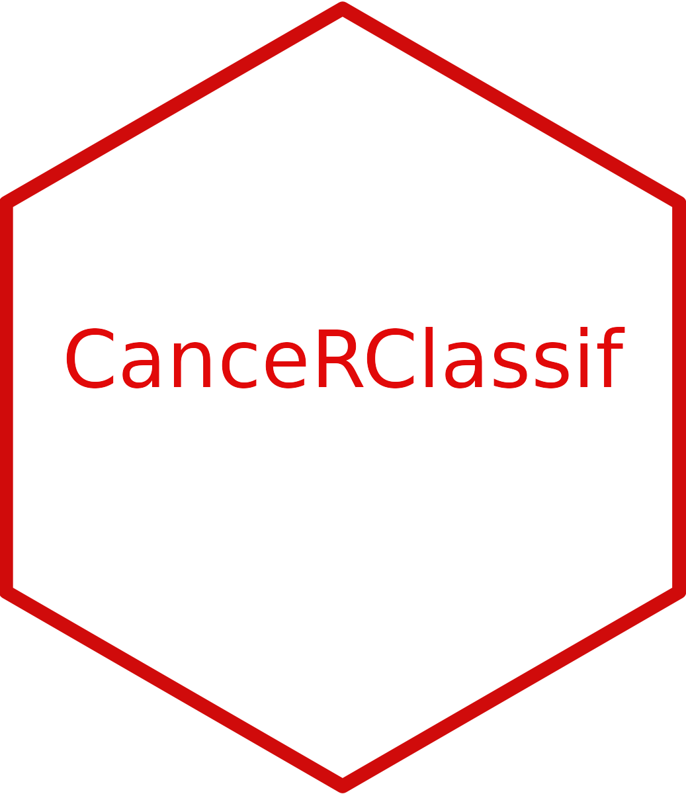
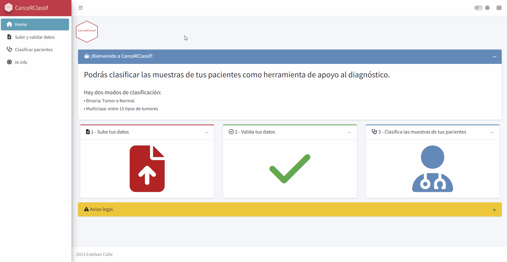

<!-- README.md is generated from README.Rmd. Please edit that file -->

```{r, include = FALSE}
knitr::opts_chunk$set(
  collapse = TRUE,
  comment = "#>",
  fig.path = "man/figures/README-",
  out.width = "100%"
)
```

# CanceRClassif </a>

> _Clasifica las muestras de tus pacientes, a nivel binario: Tumorales o Normales y a nivel multiclase: distingue entre 15 tipos distintos de cáncer._

<!-- badges: start -->
<!-- badges: end -->

## Descripción 

`CanceRClassif` es una aplicación desarrollada en Shiny que permite clasificar muestras de pacientes con datos de expresión génica RNA-Seq para detectar y clasificar si la muestra es tumoral. Se concibe como una herramienta de apoyo al diagnóstico de los profesionales sanitarios.

Tiene dos modos de clasificación:

- **Binaria**: Tumor o Normal.
- **Multiclase**: entre 15 tipos de tumores.

La tabla con los resultados y la probabilidad sobre la clasificación pueden ser descargados en .csv y .xlsx


 

## Instalación

**Online:**

Puedes utilizar la herramienta desplegada en el servidor web *shinyapps.io*


**Instalación local**

`CanceRClassif` es una app construida como paquete de R. Puedes instalarla con la ayuda de la función `install_github()` que instala la aplicación desde el repositorio Github.
Una vez instalada, tendrás la aplicación disponible a niver local. Para utilizarla debes activar la librería con la función `library()` y para lanzar la aplicación debes ejecutar la función `run_app()`.

```{r Instalation, eval=FALSE}
# Instala
remotes::install_github("estebancalle/Cancerclassif")

```

**Activación**

```{r Activacion, eval=FALSE}
# Activa la librería
library(Cancerclassif)

# Lanza la aplicación
run_app()

```


**Instalación docker**

## Modo de empleo: Proceso de Clasificación
1. Sube tus datos
2. Selecciona el dataset de trabajo, previsualizalo y valida su formato.
3. Clasifica los pacientes y bájate los resultados


## Subir los datos y validarlos.

La aplicación permite subir uno o varios archivos en diversos formatos: .csv, .tsv, .sav, .dta, .xls, .xlsx, .rds, .rda

Para probar la aplicación, Enciende el botón que carga los datos de prueba o test.

Selecciona el dataset de trabajo y confirma que se ha cargado correctamente previsualizandolo.

Valida su correcto formato antes de pasar a la clasificación.

 - Los genes deben estar en las columnas y las muestras en las filas. Las dos primeras columnas deben ser: Sample y PacienteID de formato carácter o factor.
- Las muestras deben haber sido alineadas con el genoma de referencia *hg19*.
- Las anotaciones de los genes (nombres de las columnas) deben estar formadas por 'nombre_gen|entrezgeneID' (Ej: NAT2|10). Consultar BiomaRt para más info.


## Clasifica las muestras y descárgate la tabla resultante-

Selecciona el modo de clasificación deseado y comienza la clasificación.

 - En modo Binario: Las muestras de los pacientes serán clasificadas como Normal y Tumor. Cada diagnóstico viene acompañado de una probabilidad: Verde: >= 0.75, Amarillo: >= 0.6 &  < 0.75 , Rojo: < 0.6. A nivel interno se comprenden 13 tipos de tumores: BLCA, BRCA, CESC, COAD, HNSC, KIRC, KIRP, LIHC, LUAD, LUSC, PRAD, STAD, THCA."

 - En modo Multiclase:Las muestras de los pacientes serán clasificadas en 15 tumores distintos. Se comprenden 15 tipos distintos de tumores: BLCA, BRCA, CESC, COAD, HNSC, KIRC, KIRP, LGG, LIHC, LUAD, LUSC, PRAD, OV, STAD, PRAD. Cada diagnóstico viene acompañado de una probabilidad: Verde: >= 0.75, Amarillo: >= 0.6 &  < 0.75 , Rojo: < 0.6.


La tabla resultante incluye la fecha de análisis, nombre de la muestra (Sample), código identificativo del paciente (PacienteID), el diagnóstico y la probabilidad de acierto de la clase diagnósticada según el modelo de machine learning.

La tabla es interactiva. Puedes usar filtros para explorar los resultados.

Descárgate los resultados en formato .csv o .xlxs


## Explora el funcionamiento interno

En la página info IA, del menú de navegación podrás encontrar más información sobre los algoritmos de entrenamiento y las muestras que se utilizaron para ajustar los algoritmos.


# Modifica la apariencia de la aplicación

En la barra superior de navegación podrás cambiar el modo claro u oscuro o cambiar los colores de los menús según tus preferencias.


You'll still need to render `README.Rmd` regularly, to keep `README.md` up-to-date. `devtools::build_readme()` is handy for this. You could also use GitHub Actions to re-render `README.Rmd` every time you push. An example workflow can be found here: <https://github.com/r-lib/actions/tree/v1/examples>.

